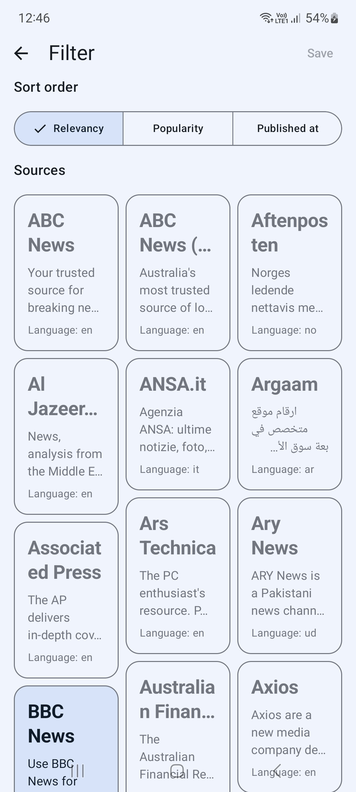
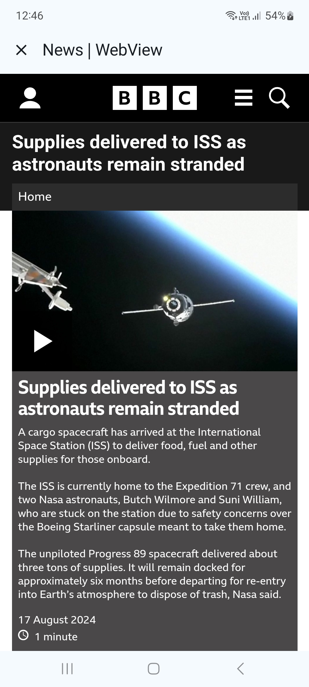

# Material News

This app was built using Jetpack Compose. The program itself is built on a multi-module architecture and uses the following technological solutions:

* Gradle convention plugin.
* Room.
* Integration of Pagging 3 with RemoteMediators.
* Multi modular.
* GitHub Actions
* WebView.

## Screenshots

</img>
</img>
</img>
</img>

## Setup Instructions

To build the project, please follow these steps:

1. Visit [The News api](https://newsapi.org/docs/endpoints/everything) to create your own API key.
2. Create a file named `local.properties` in the root directory of the project.
3. Add the following fields to the `local.properties` file:

   ```properties
   API_TOKEN=your_api_token
   BASE_URL="https://newsapi.org/v2/"